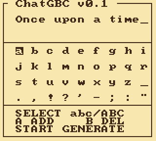

# ChatGBC

A language model that runs on a Game Boy Color. Not an emulator on a phone — a
512 KB cartridge, an 8 MHz SM83, 32 KB of RAM, and a transformer doing a full
forward pass per token in hand-written assembly. No C anywhere.



*One frame per token, about 100x the speed of the hardware — 160 tokens, some
twenty-six minutes on the handheld.*

**Watch the bottom bar.** `TOK` walks past 64, which is the entire attention
window, and nothing happens: the text just keeps going. And `CYC/TOK` climbs
while the window is filling — attention is O(context) — then **goes flat** the
moment every slot is live and old ones start being overwritten. That flattening
is the ring buffer, made visible.

You type a prompt on an on-screen keyboard. It generates, and keeps generating —
the text scrolls and it never hits a context limit. Tokenizer, weights and the
whole inference stack are on the cartridge.

## Where this started

[gbc-transformer](https://github.com/maddiedreese/gbc-transformer) got here
first, in GBDK C, and set both the model choice and the target. It runs the same
network at **169 s/token**. I wanted to know what the ceiling was if the kernel
were written by hand, which turned out to be a question about compilers: that
implementation spends ~676 cycles per multiply-accumulate, and the assembly
version spends 19.

## Numbers

| | |
|---|---|
| Model | TinyStories-260K — 5 layers, dim 64, 8 heads / 4 KV heads, vocab 512 |
| Weights | 4-bit, Lloyd–Max codebooks, per-output-row scales; 8-bit classifier |
| Arithmetic | int8 activations, 16-bit accumulators, no floating point, no division |
| **Speed** | **9.0 s/token** averaged over a 96-token run (18,951,201 M-cycles) |
| | 4.6 s for the first token, 11.1 s once the 64-token window fills |
| Quality | 76.4% top-1 agreement with fp32 on held-out prompts |
| Kernel | 19 M-cycles per multiply-accumulate |
| ROM | 512 KB, MBC5 |

Attention is O(context), so a token costs more the deeper into a passage you
are — the bar at the bottom of the screen shows the figure climbing as it goes,
then flattening once the window is full. Every number here is measured **by the
cartridge itself** using the hardware timer, not by an emulator's clock.

## Two tricks worth the click

**The multiply is a table lookup.** The SM83 has no multiplier. With 4-bit
weights there are sixteen possible weight values and 256 possible activations, so
every product the model could ever need fits in 8 KB of ROM per matrix. The
kernel copies 32 bytes into HRAM and from then on "multiply" is `ldh a, [c]` —
3,200 cycles become 200. This machine has 8 MB of ROM and almost no cycles; the
whole design is trading the abundant thing for the scarce one.

**Generation never stops, because the cache is a ring.** The slot for position
`p` is `p mod 64`, while the rotary embedding keeps rotating by the *absolute*
`p`. Rotation is where a token is; storage is where it fits. Separating them
costs one mask, and the model simply attends to the last 64 positions forever.

## Build it

Windows, PowerShell. Everything is fetched into the project; nothing touches your
PATH.

```powershell
.\bootstrap.ps1   # RGBDS, SameBoy, a .venv with PyBoy
.\build.ps1       # -> build\chatgbc.gbc
.\test.ps1        # build, then the headless test suite
.\tools\sameboy\sameboy.exe build\chatgbc.gbc
```

**Controls:** d-pad moves, `A` types, `B` deletes, `SELECT` flips case, `START`
generates — and `START` again goes back to the keyboard.

## How it is kept honest

`py/quant.py` is not a loose reference — it is a **bit-exact integer twin** of the
assembly: same quantization, rounding, saturation, order and widths. The tests
boot the ROM headlessly and assert it emits an identical token sequence, not a
similar one. Every bug becomes "at which layer do the two stop agreeing", which
is a bisection with a definite answer.

## More

- [How it works](docs/CONCEPTS.md) — a short tour of the model: tokens, heads,
  the KV cache, and why the multiply is a table lookup. No ML background needed
- [Making of](docs/MAKING-OF.md) — how it was built, and what was thrown away
- [Experiment log](docs/LOG.md) — every measurement, including the failures
- [Decisions](docs/DECISIONS.md) — design decisions and what drove them

## Credits

[karpathy/tinyllamas](https://huggingface.co/karpathy/tinyllamas) (`stories260K`)
· [gbc-transformer](https://github.com/maddiedreese/gbc-transformer) ·
[dhepper/font8x8](https://github.com/dhepper/font8x8) ·
[RGBDS](https://rgbds.gbdev.io) ·
[gbdev hardware.inc](https://github.com/gbdev/hardware.inc) ·
[PyBoy](https://github.com/Baekalfen/PyBoy) ·
[SameBoy](https://sameboy.github.io)
