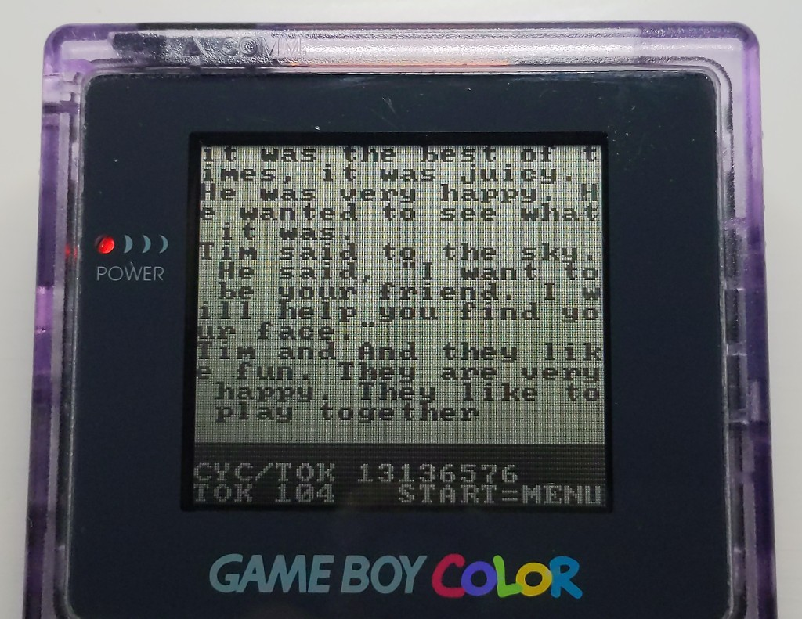

# ChatGBC

A language model that runs on a Game Boy Color written in Assembly.

v0.4 is a model trained *for* this machine, not borrowed: ternary weights,
a recurrent core instead of attention, four small experts per layer, and
an integer twin that decided every rounding before the assembly did.

**some stats:**
- 1.08 s/token, ~0.31 s per character — measured by DIV/TIMA (v0.3 was 6.16 s and 2.26 s)
- 1.15 bits per character on held-out TinyStories — better than v0.3's ROM (1.41) and better than the fp32 checkpoint v0.3 was quantized from (1.26)
- Weights are −1, 0 or +1. Three of them pick one of 27 precomputed sums: no multiplier, no product tables
- No attention, no KV cache, no window. The state is 192 bytes and the story never has to end
- Four experts per layer, one runs per token: half the work of a dense layer, twice the weights
- 374K parameters in a 256 KB ROM

_Trained on TinyStories, compared per character against v0.3_


*One frame per token, roughly 100x the speed of the hardware. 160 tokens, and
the real run is under three minutes on the handheld (v0.3 took seventeen).*

You type a prompt on an on-screen keyboard (`A` types, `B` deletes, `SELECT`
flips case, `START` generates). Tokenizer, weights and the whole inference
stack are on the cartridge.

## Numbers

| | |
|---|---|
| Model | 3 layers, dim 64, minGRU core + ReLU² MLP as 4 experts of 176, vocab 1024 BPE — 374K parameters |
| Trained on | TinyStories V2 (254K stories, 59M tokens), 20,000 steps, on a laptop GPU in 3.5 hours |
| Context | a recurrent state: 3 × 64 bytes, unbounded output, no window |
| Weights | ternary with one power-of-two scale per row; classifier and router ternary at one scale |
| Arithmetic | int8 activations and state, exact 16-bit block sums, no floating point, no division, no multiply |
| **Speed** | **1.08 s/token** (2,259,829 M-cycles), **0.31 s per character** at 3.46 characters a token |
| **Quality** | **1.146 bits/char** on 200 held-out stories, teacher-forced. v0.3: 1.412 as shipped, 1.261 in fp32 |
| Kernel | ~10.5 M-cycles per multiply-accumulate, three MACs per table lookup |

Numbers measured against HW timers; quality measured on the bit-exact twin
of the ROM, on stories the training never saw.

## Why this exists

The model behind v0.3 was [karpathy's TinyStories-260K](https://huggingface.co/karpathy/tinyllamas):
a quarter-million parameters trained on the
[TinyStories](https://arxiv.org/abs/2305.07759) corpus, whose point was that a
model this small can write coherent English at all. That result is what makes a
Game Boy LLM possible.

The idea came from a post I saw on X and looking at the repo:
[gbc-transformer](https://github.com/maddiedreese/gbc-transformer)

I wanted a different thing. In assembly every cycle is attributable to a code line.
The AI assist also made an oracle that could pre-verify what a decision costs. 

The real foundation of the project was to make a loop that would be testable fast enough to get into a **loop**. 
That is the foundation this project actually is. 
How could I do a self improving loop on my laptop. 
HW constraints allows me to look at the bits, memory dumps, and eventually train locally.

v0.4 closes that loop: the model is trained here, inside the same integers the
cartridge computes with, and judged by the same twin that judges the assembly.

## What changed since v0.3

v0.3 took a float transformer and squeezed it into 4-bit tables; the squeeze
cost 12% in bits per character and the attention window cost the rest. v0.4
turns it around: decide what the hardware does well, train a model that lives
there from step one.

**The multiply is a table of sums.** A ternary weight is −1, 0 or +1, so three
of them applied to three activations is one of 27 signed sums. The kernel
builds those 27 sums once per block of three inputs and then every weight
triple is a single `ldh a, [c]` and an add. No product tables, no bank
switch per input, and a matrix in ROM is one byte per three weights.

**The core is a minGRU, not attention.** `h = h + z ⊙ (h̃ − h)`, gates from the
input only. Three 64×64 matvecs per layer and a 64-byte state; nothing grows
with the length of the story. v0.3 needed a ring of 24 cached positions and
lost the thread when the ring wrapped. This never wraps.

**Four experts, one runs.** Each layer's MLP is four experts of 176; a
ternary router picks one per token. Half the multiply-accumulates of the dense
layer, twice the parameters, and choosing an expert is one MBC5 bank register
write.

**Trained inside the integers.** Weights are fake-quantized to ternary with
power-of-two row scales during training, activations and the recurrent state
to int8, the classifier and router to ternary at a single scale — and a
full-precision residual (the Arenas trick from
[Sherry](https://arxiv.org/abs/2601.07892)) is annealed to zero so ternary
converges at all. The exported integers score within 2% of the float model.

_Note_: the GBC is technically 8MHz but those are T-Cycles. A full instruction usually is 4 of those.
This means you really have 2MHz worth of `M` cycles, about 1 instruction each — so consider it a 2MHz HW

## Build it

Windows, PowerShell. Everything is fetched into the project; No PATH required. 
I expressly chose tools that can work this way.

```powershell
.\bootstrap.ps1   # RGBDS, SameBoy, a .venv with PyBoy and torch
.\build.ps1       # -> build\chatgbc.gbc
.\test.ps1        # build, then the headless test suite
.\tools\sameboy\sameboy.exe build\chatgbc.gbc
```

## Train it

```powershell
# TinyStories from HF roneneldan/TinyStories into models\tinystories\, then:
.venv\Scripts\python.exe py\tinystories.py                       # fold to the keyboard's alphabet
.venv\Scripts\python.exe py\tokenizer.py --corpus models\tinystories\ts_train.txt --out models\tok_ts1024.bin --vocab 1024
.venv\Scripts\python.exe py\fit.py --tokenizer models\tok_ts1024.bin --name ts3L_v1024
.venv\Scripts\python.exe py\export5.py                           # checkpoint -> blobs + model.inc
.venv\Scripts\python.exe py\score5.py                            # bits/char of what ships
.\test.ps1
```

## Twin and testing

`py/twin5.py` is a **bit-exact integer twin** of the assembly: same
quantization, rounding, saturation, order and widths. The tests boot the ROM
headlessly and assert it emits an identical token sequence.

Every bug becomes "at which layer do the two stop agreeing", which is a
bisection with a definite answer.

**HUGE KUDOS** to SameBoy and PyBoy for this. That is the work of giants.

## Proof, on the real thing



#gbdev community on Discord was kind enough to flash v0.3 to a cartridge and
capture a pic on original hardware. 

## More

- [The model](docs/THE-MODEL.md) — one page: what it runs, why MACs equal
  parameters, and what depth costs that width does not
- [How it works](docs/CONCEPTS.md) — a short tour: tokens, heads, the KV cache,
  and why the multiply is a table lookup. No ML background needed
- [Making of](docs/MAKING-OF.md) — how it was built, what was measured, and
  what was thrown away

## Credits

[TinyStories](https://arxiv.org/abs/2305.07759) (Eldan & Li; dataset
[roneneldan/TinyStories](https://huggingface.co/datasets/roneneldan/TinyStories), CDLA-Sharing-1.0) ·
[karpathy/tinyllamas](https://huggingface.co/karpathy/tinyllamas) (`stories260K`, v0.3) ·
[Were RNNs All We Needed?](https://arxiv.org/abs/2410.01201) (minGRU) ·
[Sherry](https://arxiv.org/abs/2601.07892) (the Arenas residual) ·
[gbc-transformer](https://github.com/maddiedreese/gbc-transformer) ·
[dhepper/font8x8](https://github.com/dhepper/font8x8) ·
[RGBDS](https://rgbds.gbdev.io) ·
[gbdev hardware.inc](https://github.com/gbdev/hardware.inc) ·
[PyBoy](https://github.com/Baekalfen/PyBoy) ·
[SameBoy](https://sameboy.github.io)

MIT licensed.
