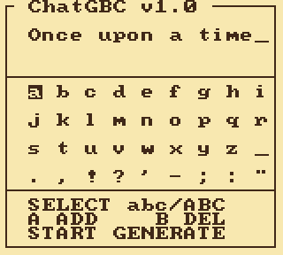
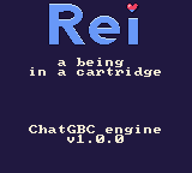
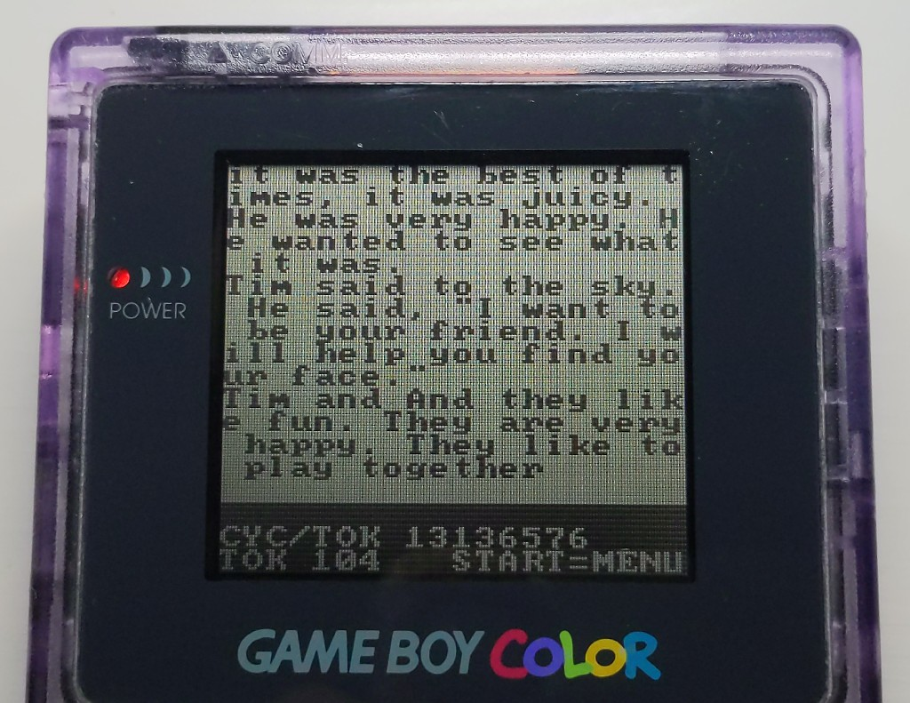

# ChatGBC

A language model that runs on a Game Boy Color written in Assembly.

v1.0 seals the engine and adds a second cartridge: **Rei**, a small being
who talks to you, asks your name and keeps it.

The story model and its tokens didn't change. The wait did: the encoder is
exact and 150 times faster, and a prompt token now only feeds the
state. A story starts in 1.8 s where it took 6.8.

**some stats:**
- 1.8 s from START to the first token (v0.9: 6.8 s)
- 0.46 s/token, 0.133 s per character — measured by DIV/TIMA with the teletype running (v0.4.1: 1.08 s)
- 1.126 bits per character on held-out TinyStories, 0.3% off the fp32 checkpoint
- Weights are −1, 0 or +1. Three of them pick one of 27 precomputed sums: no multiplier, no product tables
- The gate of the recurrent core is one byte table, the sigmoid folded in
- No attention, no KV cache, no window. The state is 192 bytes and a story runs until you press SELECT
- Four experts per layer, one runs per token: half the work of a dense layer, twice the weights
- The screen is a teletype: characters arrive while the next token computes
- 374K parameters and 61 KB of lookup tables in a 512 KB ROM

_Trained on TinyStories, compared per character against every version before it_



*One frame per character; 200 tokens, then SELECT - it would go on. The
real run is a minute and a half on the handheld; v0.4.1's took three and a
half, v0.3's 160 tokens took seventeen.*

You type a prompt on an on-screen keyboard (`A` types, `B` deletes, `SELECT`
flips case, `START` generates, `SELECT` again stops the story). Tokenizer,
weights and the whole inference stack are on the cartridge.

## Rei



*A minute of conversation, one frame per character of hers and per button
press. The second or two she thinks before each reply is cut.*

`.\build.ps1 -Rei` builds `build\rei.gbc`: the same engine, a conversational
model (374K parameters, 1,024-piece vocabulary) and a screen that tries to
feel like a small Game Boy game.

- She asks your name and keeps it, for the whole conversation and across power-off. "vincenzo" works as well as "anna"
- She says your words back: "i like tacos" - "tacos! that sounds nice."
- Pick a line from ten topics, or press `SELECT` and type. When she asks you something, the keyboard comes up by itself
- `START` shows the whole conversation. The battery saves it, and "continue" picks up exactly where you left
- Leave her alone for twenty seconds and she goes for a walk: a beach, a garden, a playroom. Sometimes she thinks out loud

How the name works: four tokens of her vocabulary are orders for the engine,
not text. One stores the last word you typed, one prints it back, one
repeats your last word, and one rides along with your line while the engine
knows your name. A 374K model can't spell a name it heard ten lines ago. It
can learn when to press the button.

| | |
|---|---|
| Speed | 0.46 s/token, 1.5 to 2.0 s from your press to her first letter |
| Limits | she is small. Sentences blend ("cats! yes! a baby panda is very tiny when it is born."), she can mix facts up, and now and then she takes a word that isn't a name ("i am seven") as your name. Tell her again and it's fixed |

## Numbers

| | |
|---|---|
| Model | 3 layers, dim 64, minGRU core + ReLU² MLP as 4 experts of 176, vocab 1024 BPE — 374K parameters, the v0.4.1 checkpoint unchanged |
| Trained on | TinyStories V2 (254K stories, 59M tokens), 20,000 steps, on a laptop GPU in 3.5 hours |
| Context | a recurrent state: 3 × 64 bytes, unbounded output, no window |
| Weights | ternary with one power-of-two scale per row; classifier and router ternary at one scale |
| Arithmetic | int8 activations and state, exact 16-bit sums, no floating point, no division, no multiply |
| **Speed** | **0.46 s/token** (962,790 M-cycles with the teletype running, over 70 tokens; 972,744 on the lab ROM's 48 golden tokens), **0.133 s per character** at 3.46 characters a token |
| **First token** | **1.8 s** from START for "Once upon a time": encode 55,552 cycles, the five prompt tokens before the last 2,694,016, the first generated 983,104 (v0.9: 8,321,536 + 4,871,488 + 983,104, 6.8 s) |
| **Quality** | **1.126 bits/char** on 200 held-out stories, teacher-forced. The same checkpoint in fp32: 1.123. v0.4.1 as shipped: 1.146 |
| Kernel | output-major: 22 tables of 27 sums built once per input vector, 12 cycles per lookup of three MACs, the row summed and requantized in registers; w2 sparse; classifier 226 cycles a row |
| ROM | 512 KB file (the MBC5 header rounds up); about 370 KB of it is weights, tables and code. New lookup tables: 60,416 B for the gate, 768 B for ReLU² |

Numbers measured against HW timers; quality measured on the bit-exact twin
of each ROM, on stories no version trained on. [VERSIONS.md](VERSIONS.md)
has every release measured the same way.

## Why this exists

The model behind v0.3 was [karpathy's TinyStories-260K](https://huggingface.co/karpathy/tinyllamas):
a quarter-million parameters trained on the
[TinyStories](https://arxiv.org/abs/2305.07759) corpus, whose point was that a
model this small can write coherent English at all. That result is what makes a
Game Boy LLM possible.

The idea came from a post I saw on X and looking at the repo:
[gbc-transformer](https://github.com/maddiedreese/gbc-transformer)

I wanted a different thing. In assembly every cycle is attributable to a code line.
The AI assist also made an oracle that could pre-verify what a decision costs. 

The real foundation of the project was to make a loop that would be testable fast enough to get into a **loop**. 
That is the foundation this project actually is. 
How could I do a self improving loop on my laptop. 
HW constraints allows me to look at the bits, memory dumps, and eventually train locally.

v0.4 closes that loop: the model is trained here, inside the same integers the
cartridge computes with, and judged by the same twin that judges the assembly.

v0.9 uses the loop the other way. The twin stayed fixed and every kernel was
rewritten against it, so the cartridge got 2.3x faster without the model
noticing.

## What's new in v1.0

- Story model and tokens unchanged; 1.8 s to the first token instead of 6.8
- Encoder exact and 150x faster: 55,552 cycles for "Once upon a time"
- Prompt tokens only feed the state; only the last one predicts
- Rei: a second cartridge that asks your name and keeps it, across power-off
- Four engine opcodes: store the name, print it, repeat your last word, and a header that tells her she knows you
- Topic tree, keyboard when she asks, log, battery save, a world to walk in

Everything before, in detail: [CHANGELOG.md](CHANGELOG.md)

## Build it

Windows, PowerShell. Everything is fetched into the project; No PATH required. 
I expressly chose tools that can work this way.

```powershell
.\bootstrap.ps1   # RGBDS, SameBoy, a .venv with PyBoy and torch
.\build.ps1       # -> build\chatgbc.gbc
.\build.ps1 -Rei  # -> build\rei.gbc (and, with -Lab, rei-lab.gbc)
.\test.ps1        # the story build and Rei, app and lab ROMs, each with its suite
.\tools\sameboy\sameboy.exe build\chatgbc.gbc
```

The checkpoints, tokenizers and the six calibration stories the export
needs are in `models\` (see [models/README.md](models/README.md)), so a fresh
clone builds both ROMs byte for byte. `-Rei` exports her checkpoint
(`models\rei.bin`, `models\tok_rei1024.bin`), builds, and puts the tracked
sources back in the story build's form, so `git status` is clean afterwards.

## Train it

```powershell
# TinyStories from HF roneneldan/TinyStories into models\tinystories\, then:
.venv\Scripts\python.exe py\tinystories.py                       # fold to the keyboard's alphabet
.venv\Scripts\python.exe py\tokenizer.py --corpus models\tinystories\ts_train.txt --out models\tok_ts1024.bin --vocab 1024
.venv\Scripts\python.exe py\fit.py --tokenizer models\tok_ts1024.bin --name ts3L_v1024
.venv\Scripts\python.exe py\export5.py                           # checkpoint -> blobs + model.inc
.venv\Scripts\python.exe py\score5.py                            # bits/char of what ships
.\test.ps1
```

## Twin and testing

`py/twin5.py` is a **bit-exact integer twin** of the assembly: same
quantization, rounding, saturation, order and widths. No rule in it changed
during v0.9 - one constant that names the classifier's blocking moved, and
it changes no integer; every kernel was rewritten to reproduce it. The tests boot the
lab ROM headlessly and assert it emits an identical token sequence.

46 tests on the story build: the golden run, strict; each kernel against
the twin's own function on planted vectors; exhaustive proofs for the gate
table and the add's byte rule; the classifier's retry path at 0 to 9
rejects; the layer-0 probes against the twin's layer-0 lines; the encoder
against the Python tokenizer; the prompt with and without the prefill
shortcut. 122 on Rei's (123 with REI_CORPUS set): the same engine tests on her checkpoint, the name
and echo opcodes on the lab ROM against the twin, and her screen driven
button by button - every reply read back from her pane and compared with
the twin's, a question bringing up the keyboard, the save continued across
a power cycle, the world visited and left.

Every bug becomes "at which layer do the two stop agreeing", which is a
bisection with a definite answer.

**HUGE KUDOS** to SameBoy and PyBoy for this. That is the work of giants.

## Proof, on the real thing



#gbdev community on Discord was kind enough to flash v0.3 to a cartridge and
capture a pic on original hardware. 

## More

- [Versions](VERSIONS.md) — every release measured the same way, with its capture
- [Changelog](CHANGELOG.md) — what changed in each release
- [The model](docs/THE-MODEL.md) — one page: what it runs, what one layer
  costs in cycles, and what depth costs that width does not
- [How it works](docs/CONCEPTS.md) — a short tour: tokens, the gate, the
  experts, the classifier, and why the multiply is a table lookup. No ML
  background needed
- [Making of](docs/MAKING-OF.md) — how it was built, what was measured, and
  what was thrown away
- [Roadmap](docs/ROADMAP.md) — what v1.0 sealed and what is left open

## Credits

[TinyStories](https://arxiv.org/abs/2305.07759) (Eldan & Li; dataset
[roneneldan/TinyStories](https://huggingface.co/datasets/roneneldan/TinyStories), CDLA-Sharing-1.0) ·
[karpathy/tinyllamas](https://huggingface.co/karpathy/tinyllamas) (`stories260K`, v0.3) ·
[Were RNNs All We Needed?](https://arxiv.org/abs/2410.01201) (minGRU) ·
[Sherry](https://arxiv.org/abs/2601.07892) (the Arenas residual) ·
[gbc-transformer](https://github.com/maddiedreese/gbc-transformer) ·
[dhepper/font8x8](https://github.com/dhepper/font8x8) ·
[RGBDS](https://rgbds.gbdev.io) ·
[gbdev hardware.inc](https://github.com/gbdev/hardware.inc) ·
[PyBoy](https://github.com/Baekalfen/PyBoy) ·
[SameBoy](https://sameboy.github.io)

MIT licensed.
