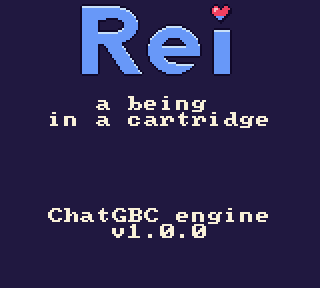

# ChatGBC

A language model that runs on a Game Boy Color written in Assembly.

v1.0 seals the engine and ships a second cartridge on it. The engine is
v0.9's - the same kernels, the same weights, the same tokens out of the
same twin - with the two parts of the wait that came before the first token
rebuilt: the encoder now gives the Python tokenizer's tokens exactly and in
a hundredth of the time, and a prompt token that only feeds the state stops
there. The story starts in 1.8 s where it took 6.8.

The second cartridge is **Rei**: the same engine with a conversational
checkpoint, on a screen built like a small Game Boy game. You pick
something to say from a list of topics, or type it, and she answers. See
[Rei](#rei) below.

v0.9 was the same model as v0.4.1 on a faster cartridge: a token takes
0.46 s where v0.4.1 took 1.08 s - 2.3x - because an audit of every stage of
the token found that most of its arithmetic could only ever produce a few
hundred distinct values, and a stage like that is a table, not a
computation.

**some stats:**
- 1.8 s from START to the first token of a story (6.8 s in v0.9): the prompt encodes in 55,552 cycles instead of 8.3 million, and its tokens run only as far as the state
- 0.46 s/token, 0.133 s per character — measured by the ROM's own DIV/TIMA counter with the teletype running (v0.4.1: 1.08 s, 0.31 s per character on the same text)
- 1.126 bits per character on held-out TinyStories, 0.3% off the fp32 checkpoint (v0.4.1 shipped the same checkpoint at 1.146)
- Weights are −1, 0 or +1. Three of them pick one of 27 sums: no multiplier, no product tables. A row of 64 inputs is 22 lookups at 12 cycles each, summed in a register pair
- The gate of the recurrent core is one byte table; the sigmoid is folded into it and never computed
- w2 touches only the pairs where both the activation and the weight are nonzero: 82% of the activations are zero
- The classifier stores no logits. It keeps the running best in a register pair, 226 cycles for each of the 1,024 rows
- No attention, no KV cache, no window. The state is 192 bytes and a story runs until you press SELECT
- Four experts per layer, one runs per token: half the work of a dense layer, twice the weights
- The screen is a teletype: one character every 0.3 s, fed from a queue on the VBlank interrupt
- 374K parameters and 61 KB of lookup tables in a 512 KB ROM

_Trained on TinyStories, compared per character against every version before it_


*One frame per character; 200 tokens, then SELECT - it would go on. The
real run is a minute and a half on the handheld; v0.4.1's took three and a
half, v0.3's 160 tokens took seventeen.*

You type a prompt on an on-screen keyboard (`A` types, `B` deletes, `SELECT`
flips case, `START` generates, `SELECT` again stops the story). Tokenizer,
weights and the whole inference stack are on the cartridge.

## Rei

`.\build.ps1 -Rei` builds `build\rei.gbc`: the v1.0 engine with Rei v1, a
conversational checkpoint (3 layers, dim 64, 4 experts of 176, 1,024-piece
vocabulary, 374K parameters) and her own screen:

- **Your name.** She asks it, and she keeps it - for the whole
  conversation, and across power-off. The model decides when: when your
  line is a name, she answers with a token of her own that stores it, and
  the engine copies the last word you typed into a slot on the cartridge.
  Where she says your name, another token of hers prints that slot, so the
  model never has to spell it: "anna" - "anna! i like how that sounds.",
  and later "what is my name" - "you are anna!". While the slot holds a
  name, each of your lines reaches her with a third token that says so;
  before you tell her, "what is my name" gets "you did not tell me yet!
  what is your name?".
- **Your words back.** A fourth token prints the word your line ends with:
  "i like tacos" - "tacos! good choice.", a word she never saw in training
  as much as one she did.
- **Topics.** Ten topics, up to ten lines each. Every line was read in
  four conversations (fresh or mid-chat, with or without a name kept) and
  kept only if her answer made sense in all four; the sheet is in
  [docs/review](docs/review/topics_rei_v1c.md). `A` picks, `B` goes back,
  `SELECT` opens a keyboard for anything else (`A` types, `B` deletes, the
  last key sends).
- **Her questions.** When her reply ends with a question mark, the keyboard
  comes up by itself, empty, for your answer; `SELECT` from it goes to the
  topics. Any other reply leaves the screen where you sent from.
- **Her pane.** The reply is typed into her frame a character at a time,
  from the VBlank interrupt while the next token computes; her face talks
  while it arrives and settles into the mood of what she said. Three dots
  under a blank bar while she thinks.
- **The log.** `START` shows the whole conversation, both sides, scrolled
  with the d-pad.
- **The save.** The cartridge has battery RAM. The conversation - the
  model's state, your name, the log, her last replies - is saved after
  every exchange, and "continue" on the menu picks it up exactly where it
  stopped: the next reply is the one it would have been without the power
  cycle.
- **The world.** Leave her alone for twenty seconds and she wanders off to
  a beach, a garden or a playroom and walks about. Now and then she thinks
  something, and what she thinks is the model's; the conversation is put
  aside for it and put back after, bit for bit.

| | |
|---|---|
| Speed | 0.46 s/token: 964,158 cycles a token over the 122 tokens of her ten replies in one measured conversation, the story model's speed (the same shape and vocabulary) |
| Waiting for her | 1.5 to 2.0 s from the press to her first token on those ten lines (mean 1.8): the encode, the prompt tokens, the pass that picks the first |
| Limits | a small model: her sentences are few, and they blend - "cats! yes! a baby panda is very tiny when it is born." (an echo, then a fact about something else). She can mix facts up. Sometimes she stores a word that is not a name as your name ("i am seven", "i am a boy"), and a bare name is not always taken - "anna", "max" and "leo" are, "tom" is not ("my name is tom" is); telling her again puts it right |



*One frame per character of hers and per button press; the second or two
she thinks before each reply is cut to one frame of the dots.*

## Numbers

| | |
|---|---|
| Model | 3 layers, dim 64, minGRU core + ReLU² MLP as 4 experts of 176, vocab 1024 BPE — 374K parameters, the v0.4.1 checkpoint unchanged |
| Trained on | TinyStories V2 (254K stories, 59M tokens), 20,000 steps, on a laptop GPU in 3.5 hours |
| Context | a recurrent state: 3 × 64 bytes, unbounded output, no window |
| Weights | ternary with one power-of-two scale per row; classifier and router ternary at one scale |
| Arithmetic | int8 activations and state, exact 16-bit sums, no floating point, no division, no multiply |
| **Speed** | **0.46 s/token** (962,790 M-cycles with the teletype running, over 70 tokens; 972,744 on the lab ROM's 48 golden tokens), **0.133 s per character** at 3.46 characters a token |
| **First token** | **1.8 s** from START for "Once upon a time": encode 55,552 cycles, the five prompt tokens before the last 2,694,016, the first generated 983,104 (v0.9: 8,321,536 + 4,871,488 + 983,104, 6.8 s) |
| **Quality** | **1.126 bits/char** on 200 held-out stories, teacher-forced. The same checkpoint in fp32: 1.123. v0.4.1 as shipped: 1.146 |
| Kernel | output-major: 22 tables of 27 sums built once per input vector, 12 cycles per lookup of three MACs, the row summed and requantized in registers; w2 sparse; classifier 226 cycles a row |
| ROM | 512 KB file (the MBC5 header rounds up); about 370 KB of it is weights, tables and code. New lookup tables: 60,416 B for the gate, 768 B for ReLU² |

Numbers measured against HW timers; quality measured on the bit-exact twin
of each ROM, on stories no version trained on. [VERSIONS.md](VERSIONS.md)
has every release measured the same way.

## Why this exists

The model behind v0.3 was [karpathy's TinyStories-260K](https://huggingface.co/karpathy/tinyllamas):
a quarter-million parameters trained on the
[TinyStories](https://arxiv.org/abs/2305.07759) corpus, whose point was that a
model this small can write coherent English at all. That result is what makes a
Game Boy LLM possible.

The idea came from a post I saw on X and looking at the repo:
[gbc-transformer](https://github.com/maddiedreese/gbc-transformer)

I wanted a different thing. In assembly every cycle is attributable to a code line.
The AI assist also made an oracle that could pre-verify what a decision costs. 

The real foundation of the project was to make a loop that would be testable fast enough to get into a **loop**. 
That is the foundation this project actually is. 
How could I do a self improving loop on my laptop. 
HW constraints allows me to look at the bits, memory dumps, and eventually train locally.

v0.4 closes that loop: the model is trained here, inside the same integers the
cartridge computes with, and judged by the same twin that judges the assembly.

v0.9 uses the loop the other way. The twin stayed fixed and every kernel was
rewritten against it, so the cartridge got 2.3x faster without the model
noticing.

## What changed since v0.9

Nothing in the model and nothing in the tokens: the golden sequence is
byte-identical, and so is everything the twin says about every input. What
moved is the wait before the first token.

**The encoder is exact, and fast.** Both vocabularies have pieces up to 11
bytes long, and the old encoder looked only as far as 7: on a line that
needed a longer piece its tokens drifted from the Python tokenizer's (3 of
Rei's 95 topic lines, for instance). It also scanned the whole vocabulary
for every adjacent pair on every merge pass, which is why "Once upon a
time" took 8.3 million cycles, four seconds, to encode. Now the exporter
lays the vocabulary out as a hash table and measures the longest piece,
and the merge loop remembers each pair's result, so a merge looks up only
the two pairs it changed. 55,552 cycles, and the tokens are Python's -
tested on every prompt the ROM and the tests use and on 300 lines of the
validation stories.

**A prompt token only feeds the state.** The argmax of every prompt token
but the last is thrown away - the next token is the prompt's. So its
forward pass stops at the last layer's state update: no wo and no FFN in
that layer, no final norm, no classifier. The next token starts from its
own embedding, so nothing skipped is ever read. About 44% of a token on the
story model, 36% on Rei's; a test runs the prompt both ways on one ROM and
compares the state after it byte for byte.

## What changed since v0.4.1

Nothing in the model. Every change below produces the same integers as the
twin for every input, which is why the golden token sequence is byte-identical
before and after, and why the tests could say so.

The method was an audit by codomain. Each stage of the token was read as a
function: what it takes in, how many distinct values it can put out. Where
the answer is small the stage becomes a table. Where the output is mostly one
value - ReLU² is 82% zeros - the work that produces the other value is
skipped. One reader per stage proposed, a second recounted every cycle against
the instruction timings and checked every exactness claim against the twin,
and the survivors were built one at a time, each in its own worktree with its
own adversarial review. The rule was at most 100 KB of new tables; the release
uses 61.

**The block matvecs go output-major.** v0.4 built a 27-sum table per block
of three inputs and walked every output row against it, into an accumulator
array in WRAM, then requantized the array in a second pass. Now the 22
tables of the input vector are built once into WRAM - by derivation, each
entry one 16-bit add from an earlier one, 381 cycles a table - and each
output row is a stream of 22 bytes, each byte already the low address of its
table entry. The row's sum lives in register pair `de` at 12 cycles per
lookup (three MACs), the shift byte follows the codes, and the requant
(round-half-up, saturate to int8) happens in registers. No accumulator
array, no zero pass, no requant pass: 302 + 8s cycles a row. wz and wh read
the same vector, so they share one build; the router's four rows ride on
w1's tables and the argmax is taken in registers before the chosen expert's
176 rows are swept.

**w2 walks only the nonzero pairs.** ReLU² is a function of one byte and one
per-layer constant, so it is a 256-byte page per layer: the twin's line
evaluated at all 256 inputs, saturation included. The loop that reads the
page is the one place that knows which activations came out nonzero, so it
writes the list. w2's weights are stored per input column as lists of output
offsets, the +1 set and the −1 set, and the kernel does one 16-bit add or
subtract per nonzero (activation, weight) pair - about 1,100 to 1,650 pairs
a layer, since 82% of the activations and 34-40% of the weights are zero.
About 68K cycles a token for the three layers on the 8-token census
(67,624) where the dense block kernel took 344,696. A guard falls back to the dense kernel above 111 nonzero activations;
the measured maximum is 88.

**The classifier keeps only the running best.** Greedy decode needs the
argmax and nothing else, and the kernel v0.9 started from stored 1,024
int16 logits to find it: zero them, add thirteen planes into every one,
rescan.
Now 16 tables of 81 sums (blocks of four ternary weights) are built per
token in a WRAM bank, each row is 16 lookups summed in `de` and compared
against the best so far, ties to the lowest index - exactly the twin's
stable argmax. No logits stored, no zero pass, no rescan. The no-repeat
rule may turn the winner down; the scan keeps a runner-up for that, and only
a third reject costs a rescan, once in about 440 tokens. 226 cycles an
output.

**The gate is one byte table.** The minGRU update `h = h + z ⊙ (h̃ − h)`
was the last place the ROM multiplied: two quarter-square products and a
shift-and-saturate, 446 cycles an element, after a 33-cycle sigmoid pass.
Two facts about the twin's line were proved over all 16,646,400 inputs:
the result equals `h + ((zg·(ht−h) + 128) >> 8)`, and it never leaves
`[min(h,ht), max(h,ht)]`, so the saturation is dead and a byte sum is the
whole answer. The table is indexed by the sigmoid value and by `ht−h`;
only 118 sigmoid values occur across the three layers, so the rows are
shared: 60,416 bytes in four banks. The sigmoid itself is never computed -
two side pages per layer turn the raw gate logit into the row's address.
47 cycles an element.

**The norm in registers.** No tables. The sum of squares accumulates in
registers without the stack, the rounding shifts peel whole bytes before
they shift bits, and x·r goes through two 16-entry nibble tables rebuilt
per norm in the matvec's idle HRAM. Each of the seven norms costs about
23K cycles, from about 46K.

**The small ones.** Embedding rows are stored already requantized to the
stream's grid, so the embed is a copy (13,368 cycles to 448). The layer-0
debug snapshots that the shipping ROM used to take for nothing assemble
only in the lab build. The residual add is a 34-cycle page-form loop with
the overflow read from the sign bits.

Two fixes to the integer path that landed between the tags ship with it,
and they are why the quality line moved although the weights did not: the
residual stream is pinned to the grid the trainer used (v0.4.1 had
calibrated it four times coarser), and the norm's width factor is folded
into its gains. The first moves the score at dim 64 from 1.146 to 1.126;
the second is exact at this width. Both are in the twin, so the tree v0.9
started from already had them, at 2,164,704 cycles a token on the 8-token
census (the v0.4.1 release measured 2,259,829 with the teletype off,
2,271,104 with it).

On that census the token went from 2,164,704 cycles to 973,032:
classifier 423,496 → 246,712; w1 with the router 332,680 → 202,728; w2
344,696 → 67,624; the three norms 326,024 → 162,720; gate and sigmoid
92,488 → 9,192; ReLU² 59,032 → 8,752; the five requant passes 155K → 19,800.
The ROM file grew from 256 KB to 512 KB: the w2 column lists and the gate
table take the content to about 370 KB, and the MBC5 header rounds to the
next power of two.

## What changed since v0.3

v0.3 took a float transformer and squeezed it into 4-bit tables and a
24-token window. Measured on held-out stories, the squeeze cost 31% in bits
per character: the checkpoint scored 0.88, the cartridge 1.15. v0.4 turned
it around: decide what the hardware does well, train a model that lives
there from step one, and ship what was trained.

**The multiply became a table of sums.** A ternary weight is −1, 0 or +1,
so three of them applied to three activations is one of 27 signed sums.
v0.4 built those sums once per block of three inputs and retired three
multiply-accumulates per lookup. No product tables, no bank switch per
input, and a matrix in ROM is one byte per three weights. v0.9 keeps the
27 sums and changes who walks whom.

**The core became a minGRU, not attention.** `h = h + z ⊙ (h̃ − h)`, gates
from the input only. Three 64×64 matvecs per layer and a 64-byte state;
nothing grows with the length of the story. v0.3 needed a ring of 24
cached positions and lost the thread when the ring wrapped. This never
wraps, so the story never has to end.

**Four experts, one runs.** Each layer's MLP is four experts of 176; a
ternary router picks one per token. Half the multiply-accumulates of the
dense layer, twice the parameters, and choosing an expert is one MBC5 bank
register write.

**Trained inside the integers.** Weights fake-quantized to ternary with
power-of-two row scales during training, activations and the recurrent
state to int8, the classifier and router to ternary at a single scale, and
a full-precision residual (the Arenas trick from
[Sherry](https://arxiv.org/abs/2601.07892)) annealed to zero so ternary
converges at all. In float, stories260K is still the better model (0.88
bits per character against 1.12); what v0.4 bought is that nothing is lost
between the training run and the cartridge.

**The teletype.** A token is three or four characters, and they used to
land in one burst followed by a second of nothing. v0.4.1 put them in a
queue; the VBlank handler releases one every 18 frames while the forward
pass is busy with the next token, and is the only thing that touches VRAM
during a story. The model never waits for the screen.

_Note_: the GBC is technically 8MHz but those are T-Cycles. A full instruction usually is 4 of those.
This means you really have 2MHz worth of `M` cycles, about 1 instruction each — so consider it a 2MHz HW

## Build it

Windows, PowerShell. Everything is fetched into the project; No PATH required. 
I expressly chose tools that can work this way.

```powershell
.\bootstrap.ps1   # RGBDS, SameBoy, a .venv with PyBoy and torch
.\build.ps1       # -> build\chatgbc.gbc
.\build.ps1 -Rei  # -> build\rei.gbc (and, with -Lab, rei-lab.gbc)
.\test.ps1        # the story build and Rei, app and lab ROMs, each with its suite
.\tools\sameboy\sameboy.exe build\chatgbc.gbc
```

The checkpoints, tokenizers and the six calibration stories the export
needs are in `models\` (see [models/README.md](models/README.md)), so a fresh
clone builds both ROMs byte for byte. `-Rei` exports her checkpoint
(`models\rei.bin`, `models\tok_rei1024.bin`), builds, and puts the tracked
sources back in the story build's form, so `git status` is clean afterwards.

## Train it

```powershell
# TinyStories from HF roneneldan/TinyStories into models\tinystories\, then:
.venv\Scripts\python.exe py\tinystories.py                       # fold to the keyboard's alphabet
.venv\Scripts\python.exe py\tokenizer.py --corpus models\tinystories\ts_train.txt --out models\tok_ts1024.bin --vocab 1024
.venv\Scripts\python.exe py\fit.py --tokenizer models\tok_ts1024.bin --name ts3L_v1024
.venv\Scripts\python.exe py\export5.py                           # checkpoint -> blobs + model.inc
.venv\Scripts\python.exe py\score5.py                            # bits/char of what ships
.\test.ps1
```

## Twin and testing

`py/twin5.py` is a **bit-exact integer twin** of the assembly: same
quantization, rounding, saturation, order and widths. No rule in it changed
during v0.9 - one constant that names the classifier's blocking moved, and
it changes no integer; every kernel was rewritten to reproduce it. The tests boot the
lab ROM headlessly and assert it emits an identical token sequence.

46 tests on the story build: the golden run, strict; each kernel against
the twin's own function on planted vectors; exhaustive proofs for the gate
table and the add's byte rule; the classifier's retry path at 0 to 9
rejects; the layer-0 probes against the twin's layer-0 lines; the encoder
against the Python tokenizer; the prompt with and without the prefill
shortcut. 123 on Rei's: the same engine tests on her checkpoint, the name
and echo opcodes on the lab ROM against the twin, and her screen driven
button by button - every reply read back from her pane and compared with
the twin's, a question bringing up the keyboard, the save continued across
a power cycle, the world visited and left.

Every bug becomes "at which layer do the two stop agreeing", which is a
bisection with a definite answer.

**HUGE KUDOS** to SameBoy and PyBoy for this. That is the work of giants.

## Proof, on the real thing


#gbdev community on Discord was kind enough to flash v0.3 to a cartridge and
capture a pic on original hardware. 

## More

- [Versions](VERSIONS.md) — every release measured the same way, with its capture
- [The model](docs/THE-MODEL.md) — one page: what it runs, what one layer
  costs in cycles, and what depth costs that width does not
- [How it works](docs/CONCEPTS.md) — a short tour: tokens, the gate, the
  experts, the classifier, and why the multiply is a table lookup. No ML
  background needed
- [Making of](docs/MAKING-OF.md) — how it was built, what was measured, and
  what was thrown away
- [Roadmap](docs/ROADMAP.md) — what v1.0 sealed and what is left open

## Credits

[TinyStories](https://arxiv.org/abs/2305.07759) (Eldan & Li; dataset
[roneneldan/TinyStories](https://huggingface.co/datasets/roneneldan/TinyStories), CDLA-Sharing-1.0) ·
[karpathy/tinyllamas](https://huggingface.co/karpathy/tinyllamas) (`stories260K`, v0.3) ·
[Were RNNs All We Needed?](https://arxiv.org/abs/2410.01201) (minGRU) ·
[Sherry](https://arxiv.org/abs/2601.07892) (the Arenas residual) ·
[gbc-transformer](https://github.com/maddiedreese/gbc-transformer) ·
[dhepper/font8x8](https://github.com/dhepper/font8x8) ·
[RGBDS](https://rgbds.gbdev.io) ·
[gbdev hardware.inc](https://github.com/gbdev/hardware.inc) ·
[PyBoy](https://github.com/Baekalfen/PyBoy) ·
[SameBoy](https://sameboy.github.io)

MIT licensed.
