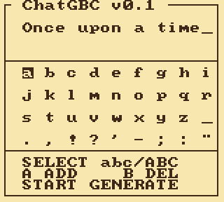
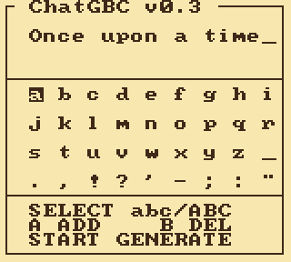
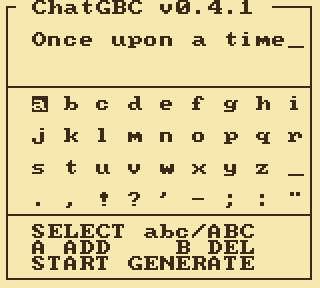

# Versions

Every release is a tag on `master` (`v0.1`, `v0.2`, `v0.3`, `v0.4.1`), and the
ROM of each is attached to its GitHub release. Tags are the checkpoints;
`master` is the line. There are no per-version branches: a branch and a tag
with the same name make every `git checkout v0.3` ambiguous, and a released
version does not move.

All numbers below are **measured**, not remembered: cycles on the cartridge's
own DIV/TIMA counter, quality on the bit-exact integer twin of each ROM, run
from that version's own tag with its own tokenizer, teacher-forced on the same
200 held-out TinyStories (V2 validation, up to 256 tokens each - text no
version trained on). Bits per character is the one quality figure two
different tokenizers can share; seconds per character is the one the reader
feels.

| | v0.1 | v0.2 | v0.3 | **v0.4.1** |
|---|---|---|---|---|
| Released | 2026-08-23 | 2026-08-24 | 2026-09-02 | 2026-09-05 |
| Model | stories260K, 4-bit | stories260K, 4-bit | stories260K, 4-bit | **trained here**: minGRU + 4 ternary experts |
| Parameters | 260K | 260K | 260K | 374K |
| Context | 64-token window | 32-token window | 24-token window | recurrent state, no window |
| Cycles / token | 18,951,201 | 13,724,256 | 12,918,757 | **2,259,829** (2,271,104 with the teletype) |
| Seconds / token | 9.0 | 6.5 | 6.16 | **1.08** |
| Characters / token (held-out text) | 2.10 | 2.10 | 2.10 | 3.46 |
| Seconds / character (held-out text) | 4.3 | 3.1 | 2.94 | **0.31** |
| Bits / character, as shipped | 1.200 | 1.231 | 1.149 | **1.146** |
| Bits / character, its fp32 checkpoint | 0.876 | 0.876 | 0.876 | 1.123 |
| Lost to quantization (and the window) | 37% | 41% | 31% | 2% |
| ROM | 512 KB | 512 KB | 512 KB | 256 KB |
| Kernel | 19 cycles / MAC, product tables | 19 | 19 | ~10.5, three MACs a lookup |

v0.3's README quotes 2.26 s per character at 2.73 characters a token: that was
measured on the ROM's own output, which uses shorter words than real
TinyStories. The column above uses the held-out text for every version so the
rows compare.

The float row is the honest one to stare at. stories260K is a better model
than v0.4's (0.88 bits per character against 1.12); it just could not get
through 4-bit tables and a 24-token window intact, and v0.4's model can get
through ternary weights and int8 state losing 2%. Level as shipped, at seven
times the characters per second, in half the ROM - and the cycles that
freed are what the next model spends.

## What each version changed

**v0.1** - the parity ROM. karpathy's stories260K transformer in pure SM83
assembly: 4-bit Lloyd-Max weights, the multiply as an 8 KB product table per
matrix, int8 activations, a 64-position KV ring so generation never stops.
9.0 s/token where the reference C implementation took 169.

**v0.2** - the window as a knob. 32 positions instead of 64: attention is the
only part of a token that grows with context, and half the window is a third
of the token. 16-bit accumulators bought by quarter-scaling the products.

**v0.3** - the shipped transformer. 24-position window, 8-bit KV projections
and classifier, no-repeat decoding, a register argmax. 6.16 s/token. The
version the #gbdev community flashed to a cartridge.

**v0.4** - a model trained for the machine. No transformer: a minGRU core
(three 64x64 matvecs a layer, a 64-byte state, nothing that grows with the
story), a four-expert ReLU² MLP with one expert running per token, ternary
weights with power-of-two row scales, and a block kernel that retires three
multiply-accumulates per table lookup. Trained on TinyStories inside the same
integers the cartridge computes with (Arenas residual from Sherry), so the
exported ROM scores within 2% of its float checkpoint. 1024-piece tokenizer,
256 KB ROM.

**v0.4.1** - the teletype, and no end. Characters go into a queue and the
VBlank handler releases one every 18 frames while the next token computes;
the screen is a steady stream instead of a burst a second. A story runs
until SELECT: the recurrent state has no window to fall off, and the
no-repeat history slides along the last 176 tokens.

## The captures

v0.1 to v0.3: one frame per token, roughly 100x the speed of the hardware,
160 tokens each. v0.4.1: one frame per character at about five times the
hardware's pace, 200 tokens and then SELECT - past the old cap, and it
would go on.

| v0.1 | v0.2 |
|---|---|
|  |  |

| v0.3 | v0.4.1 |
|---|---|
|  |  |

## How the numbers were taken

- **Cycles per token**: the ROM's own `CYC/TOK` counter (DIV/TIMA), averaged
  over a run; v0.4's staged census (`py/census5.py`) agrees with it to within a
  percent.
- **Bits per character**: each version checked out at its tag and scored with
  its own twin (`py/quant.py` for the transformers, `py/twin5.py` via
  `py/score5.py` for v0.4), teacher-forced over the first 200 stories of
  TinyStoriesV2-GPT4-valid, up to 256 tokens each, with the window that
  shipped; bits summed over the predicted tokens and divided by the characters
  those tokens spell. The fp32 row is the same protocol on the float checkpoint
  with full context.
- **Characters per token**: the version's tokenizer on the same stories.
