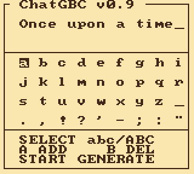

# Versions

Every release is a tag on `master` (`v0.1`, `v0.2`, `v0.3`, `v0.4.1`,
`v0.9`), and the ROM of each is attached to its GitHub release. Tags are the
checkpoints; `master` is the line. There are no per-version branches: a
branch and a tag with the same name make every `git checkout v0.3`
ambiguous, and a released version does not move. v0.5 through v0.8 do not
exist as releases; the number jumped, and the v0.9 paragraph below says why.

All numbers below are **measured**, not remembered: cycles on the cartridge's
own DIV/TIMA counter, quality on the bit-exact integer twin of each ROM, run
from that version's own tag with its own tokenizer, teacher-forced on the same
200 held-out TinyStories (V2 validation, up to 256 tokens each - text no
version trained on). Bits per character is the one quality figure two
different tokenizers can share; seconds per character is the one the reader
feels.

| | v0.1 | v0.2 | v0.3 | v0.4.1 | **v0.9** |
|---|---|---|---|---|---|
| Released | 2026-08-23 | 2026-08-24 | 2026-09-02 | 2026-09-05 | 2026-09 |
| Model | stories260K, 4-bit | stories260K, 4-bit | stories260K, 4-bit | **trained here**: minGRU + 4 ternary experts | same as v0.4.1 |
| Parameters | 260K | 260K | 260K | 374K | 374K |
| Context | 64-token window | 32-token window | 24-token window | recurrent state, no window | recurrent |
| Cycles / token | 18,951,201 | 13,724,256 | 12,918,757 | 2,259,829 (2,271,104 with the teletype) | **963,792** with the teletype (972,744 on the lab's golden run) |
| Seconds / token | 9.0 | 6.5 | 6.16 | 1.08 | **0.46** |
| Characters / token (held-out text) | 2.10 | 2.10 | 2.10 | 3.46 | 3.46 |
| Seconds / character (held-out text) | 4.3 | 3.1 | 2.94 | 0.31 | **0.133** |
| Bits / character, as shipped | 1.200 | 1.231 | 1.149 | 1.146 | **1.126** |
| Bits / character, its fp32 checkpoint | 0.876 | 0.876 | 0.876 | 1.123 | 1.123 |
| Lost to quantization (and the window) | 37% | 41% | 31% | 2% | 0.3% |
| ROM | 512 KB | 512 KB | 512 KB | 256 KB | 512 KB |
| Kernel | 19 cycles / MAC, product tables | 19 | 19 | ~10.5, three MACs a lookup | output-major tables: 12 cycles per three MACs; w2 sparse; classifier 226 cycles a row |

v0.3's README quotes 2.26 s per character at 2.73 characters a token: that was
measured on the ROM's own output, which uses shorter words than real
TinyStories. The column above uses the held-out text for every version so the
rows compare.

The float row is the honest one to stare at. stories260K is a better model
than v0.4's (0.88 bits per character against 1.12); it just could not get
through 4-bit tables and a 24-token window intact, and v0.4's model gets
through ternary weights and int8 state losing 2%, 0.3% on the v0.9 tree.
v0.9 changes nothing in that row: same checkpoint, same 1.123. What it
changes is the cycles row, by 2.3x, with the shipped row moving only by
the two fixes described below.

## What each version changed

**v0.1** - the parity ROM. karpathy's stories260K transformer in pure SM83
assembly: 4-bit Lloyd-Max weights, the multiply as an 8 KB product table per
matrix, int8 activations, a 64-position KV ring so generation never stops.
9.0 s/token where the reference C implementation took 169.

**v0.2** - the window as a knob. 32 positions instead of 64: attention is the
only part of a token that grows with context, and half the window is a third
of the token. 16-bit accumulators bought by quarter-scaling the products.

**v0.3** - the shipped transformer. 24-position window, 8-bit KV projections
and classifier, no-repeat decoding, a register argmax. 6.16 s/token. The
version the #gbdev community flashed to a cartridge.

**v0.4** - a model trained for the machine. No transformer: a minGRU core
(three 64x64 matvecs a layer, a 64-byte state, nothing that grows with the
story), a four-expert ReLU² MLP with one expert running per token, ternary
weights with power-of-two row scales, and a block kernel that retires three
multiply-accumulates per table lookup. Trained on TinyStories inside the same
integers the cartridge computes with (Arenas residual from Sherry), so the
exported ROM scores within 2% of its float checkpoint. 1024-piece tokenizer,
256 KB ROM.

**v0.4.1** - the teletype, and no end. Characters go into a queue and the
VBlank handler releases one every 18 frames while the next token computes;
the screen is a steady stream instead of a burst a second. A story runs
until SELECT: the recurrent state has no window to fall off, and the
no-repeat history slides along the last 176 tokens.

**v0.9** - the same weights at 2.3x, bit for bit. The number jumps because
the work planned for v0.5 to v0.8 - one-bit kernels, a plane classifier,
the stream on the trainer's grid - landed
on the tree as options, and an audit of the whole token showed that the
biggest gain left was not a better model but a cheaper token for the model
we had. The audit read every stage of the token by its codomain (how many
distinct outputs a stage can produce given its inputs) and found that over
half of the token was arithmetic whose outputs could only take a few
hundred values. Each such stage became a table or a skip, each exact: the
ROM reproduces the twin integer for integer, so nothing was retrained and
the golden sequence did not move. On the 8-token census the token went
from 2,164,704 cycles to 973,032, 55% off. The block matvecs (wz, wh, wo, w1 and the router) go
output-major over 22 tables of 27 sums built once per input vector, the
row summed and requantized in registers - 12 cycles per three MACs, no
accumulator array. w2 walks only the nonzero (activation, weight) pairs,
listed by the ReLU² loop as it finds them, about 68K cycles a token on
the 8-token census (67,624) where the dense kernel took 344,696. The classifier keeps only the running best in a
register pair over 16 tables of 81 sums, 226 cycles a row, no logits
stored. The minGRU gate is one byte table with the sigmoid folded in, after
a proof over all 16,646,400 inputs that its saturation never fires. The
norm's shifts peel whole bytes and its sum of squares stays in registers.
Embedding rows are stored on the stream's grid. 61 KB of new tables against
a budget of 100. Two fixes to the integer path that landed between the
tags also ship: the residual stream is pinned to the grid the trainer used
(v0.4.1 had calibrated it four times coarser), and the norm's width factor
is folded into its gains. The first is what moves the score at dim 64 from
1.146 to 1.126; the second is exact at this width. 512 KB ROM.

## The captures

v0.1 to v0.3: one frame per token, roughly 100x the speed of the hardware,
160 tokens each. v0.4.1 and v0.9: one frame per character, 200 tokens and
then SELECT - past the old cap, and it would go on. At one frame per
character the two look alike; the difference is in how long the real run
took.

| v0.1 | v0.2 |
|---|---|
|  |  |

| v0.3 | v0.4.1 |
|---|---|
|  |  |

| v0.9 | |
|---|---|
|  | |

## How the numbers were taken

- **Cycles per token**: the ROM's own `CYC/TOK` counter (DIV/TIMA), averaged
  over a run - 96 tokens for v0.1 to v0.3, 100 for v0.9 with the teletype
  running; v0.4.1's 2,259,829 is with the teletype off. The staged census
  (`py/census5.py`, 8 tokens, one timer per stage) agrees with it to within a
  percent: 973,032 against 963,792 for v0.9. From v0.9 the token is
  data-dependent, because the sparse w2 kernel does one add per nonzero
  (activation, weight) pair and the count varies by a factor of ten story to
  story; the 8-token census is a snapshot of one prompt, the 100-token
  counter the average the reader sees, and the lab ROM's golden run
  (972,744 over 48 tokens) sits between them. The three agree to one
  percent, which is the spread to expect.
- **Bits per character**: each version checked out at its tag and scored with
  its own twin (`py/quant.py` for the transformers, `py/twin5.py` via
  `py/score5.py` for v0.4 and v0.9), teacher-forced over the first 200
  stories of TinyStoriesV2-GPT4-valid, up to 256 tokens each, with the
  window that shipped; bits summed over the predicted tokens and divided by
  the characters those tokens spell. The fp32 row is the same protocol on the
  float checkpoint with full context. A version is scored only with its own
  tag's code: v0.4.1's twin gives 1.146 and v0.9's gives 1.126 for the same
  weights, and both are right about their ROM.
- **Characters per token**: the version's tokenizer on the same stories
  (3.464 for the 1024-piece tokenizer, rounded in the table).
